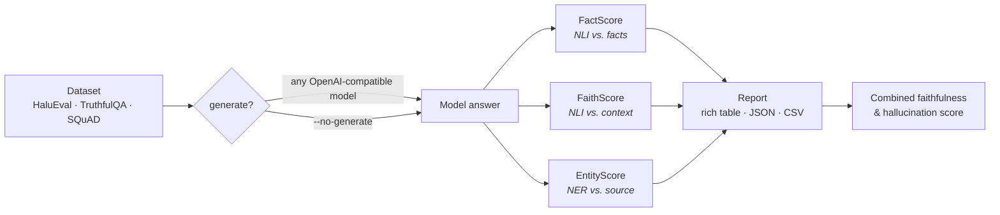
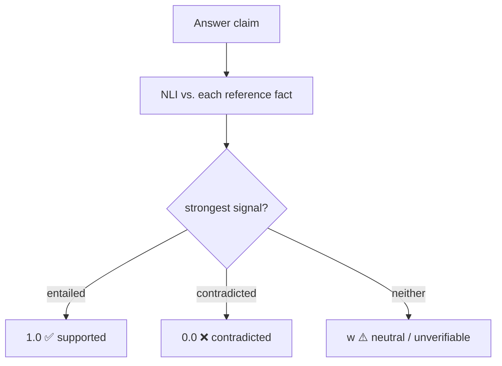
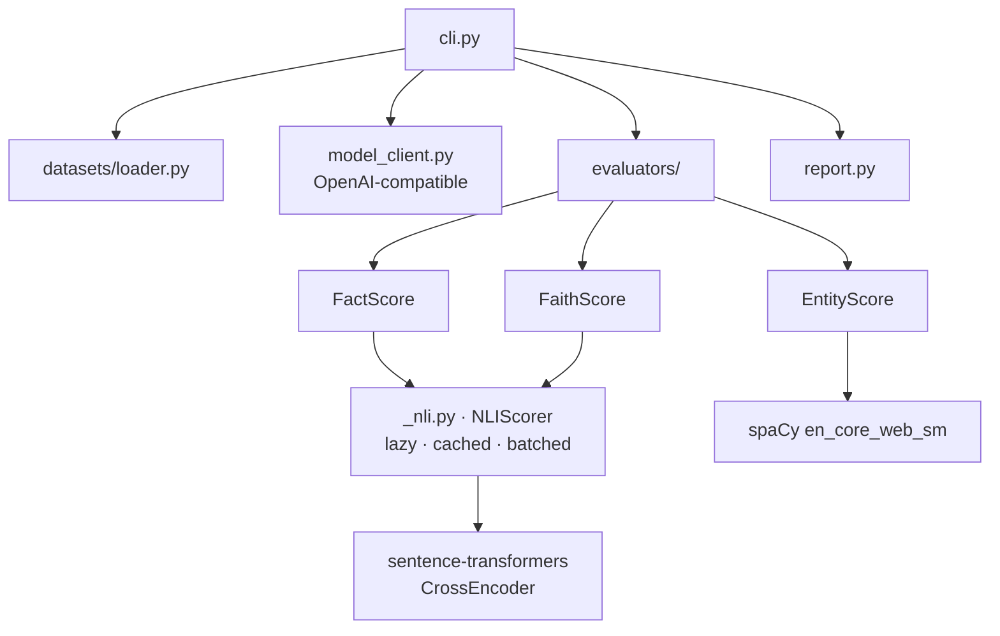

<div align="center">

# 🧪 hallucination-eval

### Catch your LLM making things up — three reference-grounded metrics, any OpenAI-compatible model, one command.

[](https://colab.research.google.com/github/JananiV07/hallucination-eval/blob/main/notebooks/walkthrough.ipynb)
[](https://github.com/JananiV07/hallucination-eval/actions/workflows/ci.yml)
[](LICENSE)
[](https://www.python.org/downloads/)
[](https://huggingface.co/cross-encoder/nli-deberta-v3-small)

</div>

---

**hallucination-eval** scores how much a language model *makes things up*, using three
complementary, **reference-grounded** metrics instead of an expensive, biased
LLM-as-a-judge. Point it at any OpenAI-compatible endpoint (OpenAI, **Google Gemini**,
Ollama, vLLM, Together, Groq, OpenRouter…), pick a benchmark, and get a scored report —
in the terminal, as JSON, and as CSV.

```bash
pip install hallucination-eval && python -m spacy download en_core_web_sm
hallucination-eval --model gemini-2.5-flash --dataset halueval --limit 50 --show-samples
```

## What it does



## The three lenses on hallucination

| Metric | The question it answers | Backend | Needs |
| --- | --- | --- | --- |
| **FactScore** | Are the answer's claims **consistent with known facts**? | NLI cross-encoder | a reference answer |
| **FaithScore** | Is every claim **grounded in the provided context**? | NLI cross-encoder | a context passage |
| **EntityScore** | Do the answer's named **entities appear in the source**? | spaCy NER | a source passage |

Every metric returns a score in `[0, 1]` where **higher = less hallucination**.

## Why hallucination-eval?

- 🎯 **Reference-grounded, not LLM-as-judge.** Deterministic, cheap, reproducible, and free of judge-model bias — the verdict comes from a 184 MB NLI model and spaCy NER, not another API call.
- 🧭 **Three signals, not one.** Factual consistency, contextual faithfulness, and entity grounding catch *different* failure modes.
- 🔌 **Plug in any model.** One `--base-url` away from OpenAI, Gemini, or a local Ollama/vLLM server. Gemini and Ollama presets are built in.
- 🛡️ **Applicability-aware scoring.** A metric that can't apply to a dataset (e.g. FaithScore on context-free TruthfulQA) is shown as `n/a` and **excluded from the combined score** — so it never silently drags the headline number down.
- ⚡ **Fast & honest.** Batched NLI inference + an on-disk score cache; ships **real measured numbers** and documents its **limitations** instead of hiding them.

## Install

```bash
pip install hallucination-eval          # or: pip install -e .  (from a clone)
python -m spacy download en_core_web_sm  # required for EntityScore
```

The first scoring run downloads the NLI model
[`cross-encoder/nli-deberta-v3-small`](https://huggingface.co/cross-encoder/nli-deberta-v3-small)
(~184 MB) from the HuggingFace Hub.

## 60-second quickstart

**CLI — generate answers with a model, then score them:**

```bash
# Google Gemini (uses GEMINI_API_KEY) — built-in preset
export GEMINI_API_KEY=...
hallucination-eval --model gemini-2.5-flash --dataset halueval --limit 50 -o run.json --csv run.csv

# OpenAI
export OPENAI_API_KEY=sk-...
hallucination-eval --model gpt-4o-mini --dataset halueval --limit 50

# A local open model via Ollama (OpenAI-compatible) — built-in presets
hallucination-eval --model mistral --dataset halueval
hallucination-eval --model gemma2  --dataset halueval

# Any custom endpoint + model id
hallucination-eval --model my-llama-3 --base-url http://localhost:8000/v1 --dataset squad

# No API key needed — score the dataset's own gold / hallucinated answers
hallucination-eval --dataset halueval --no-generate
hallucination-eval --dataset halueval --use-hallucinated --show-samples

# Compare two saved runs side by side
hallucination-eval --compare run_a.json run_b.json
```

**Python API:**

```python
from hallucination_eval import FactScore, FaithScore, EntityScore

context = "The Eiffel Tower is in Paris, France. It was completed in 1889."
question = "Where is the Eiffel Tower?"
answer = "The Eiffel Tower is in Paris and was completed in 1889."

FactScore().evaluate(question, context, answer)    # ~1.0  (consistent)
FaithScore().evaluate(question, context, answer)   # ~1.0  (grounded)
EntityScore().evaluate(question, context, answer)  # ~1.0  (entities grounded)

# Batch scoring -> {mean, min, max, std, count, scores, details, applicable}
FactScore().evaluate_batch([
    {"id": "1", "question": question, "context": context, "reference": context, "answer": answer}
])["mean"]
```

## 📊 Leaderboard

> Models generated answers on **HaluEval (qa)**, which were then scored. `↑` higher is better; `↓` lower is better.
> Reproduce with `hallucination-eval --model <m> --dataset halueval`.
> A small **N=10** demo run measured by this repo — rerun with a larger `--limit` for stable numbers, and see [Caveats](#caveats-read-before-trusting-a-number) for how to read FaithScore.

| Model | N | FactScore ↑ | FaithScore ↑ | EntityScore ↑ | Hallucination ↓ |
| --- | --: | --: | --: | --: | --: |
| gemini-flash-latest | 10 | 0.45 | **0.82** | **0.83** | **0.30** |
| gemini-2.5-flash | 10 | **0.53** | 0.50 | 0.70 | 0.43 |
| gemini-flash-lite-latest | 10 | 0.38 | 0.68 | 0.65 | 0.43 |

<sub>Want your model here? Run the CLI and open a PR with the JSON report.</sub>

## How the scores work

All three split the answer into atomic claims/sentences and score each, then average.

### FactScore — factual consistency vs. a reference

For each claim, run NLI against every reference fact and keep the strongest signal:

```
score(claim) = 1.0   if entailed      (max P(entail) ≥ τ_e  and  ≥ max P(contra))
             = 0.0   if contradicted  (max P(contra) ≥ τ_c  and  >  max P(entail))
             = w     otherwise         (neutral / unverifiable, default w = 0.5)

FactScore = mean over claims
```



### FaithScore — faithfulness vs. the context

Same NLI engine, but the **premise is the context passage** (chunked to fit the model) and the hypothesis is each answer sentence. Sentences are `supported` (1.0), `contradicted` (0.0), or `unsupported` (w). Catches claims the model added that the passage never backs.

### EntityScore — entity grounding vs. the source

```
EntityScore = |entities(answer) ∩ entities(source)| / |entities(answer)|
```

spaCy NER on both texts; an answer with no entities scores `1.0` (nothing to fabricate).

The report also prints a **combined faithfulness** (mean of the *applicable* metric means) and its complement, the **hallucination score** (`1 − combined`).

## Datasets

| Dataset | `--dataset` | Context? | Best for |
| --- | --- | --- | --- |
| **HaluEval** (qa) | `halueval` | ✅ `knowledge` passage | all three metrics; `--use-hallucinated` sanity check |
| **TruthfulQA** (generation) | `truthfulqa` | ❌ none | **FactScore** (`--evaluators fact`) |
| **SQuAD** v1.1 | `squad` | ✅ Wikipedia passage | **FaithScore** & EntityScore on grounded answers |

## Features

- **Built-in model presets** — `gpt-4o-mini`, `gemini-2.5-flash`, `gemini-flash-latest`, `gemini-flash-lite-latest`, `gemma2`, `mistral`, plus any `--model <id> --base-url <url>`.
- **Batched NLI** — all of a sample's claim×reference (or sentence×chunk) pairs go through the cross-encoder in one call.
- **Score cache** — `--cache cache.json` memoises NLI results across runs.
- **Outputs** — coloured terminal table, `--output report.json`, `--csv scores.csv` (formula-injection safe), per-label breakdowns, `--show-samples`.
- **`--compare a.json b.json …`** — side-by-side model comparison with the best score per metric highlighted.
- **Applicability-aware** — context-dependent metrics are excluded from the combined score on context-free datasets.

## Architecture



```
src/hallucination_eval/
├── evaluators/{base,fact_score,faith_score,entity_score}.py
├── _nli.py          # shared NLI cross-encoder: lazy load, label resolution, cache
├── _text.py         # sentence splitting / context chunking
├── model_client.py  # OpenAI-compatible client + presets
├── datasets/loader.py
├── report.py        # rich table · JSON · CSV · comparison
└── cli.py
```

## CLI reference

| Flag | Description |
| --- | --- |
| `--model` | Preset name or model id (default `gpt-4o-mini`) |
| `--dataset` | `halueval` · `truthfulqa` · `squad` |
| `--split` / `--config` / `--limit` | Dataset split, config, and sample cap |
| `--base-url` / `--api-key` | Endpoint + key overrides (else from env) |
| `--evaluators` | Subset of `fact,faith,entity` |
| `--reference FILE` | Override FactScore references from a JSON file |
| `--nli-model` / `--device` | NLI cross-encoder id / torch device |
| `--system-prompt` / `--temperature` / `--max-tokens` | Generation controls |
| `--no-generate` / `--use-hallucinated` | Score gold / known-bad answers |
| `--output/-o` / `--csv` / `--cache` | JSON report / CSV / NLI cache paths |
| `--compare R1 R2 …` | Compare saved JSON reports and exit |
| `--show-samples` | Print a per-sample score table |

## Development

```bash
pip install -e ".[dev]" && python -m spacy download en_core_web_sm
pytest                 # fast mocked unit tests (CI runs these on every push)
pytest -m integration  # real NLI + spaCy models (downloads weights; weekly CI)
```

CI: [`tests`](.github/workflows/ci.yml) on every push (Python 3.11 & 3.12),
[`integration`](.github/workflows/integration.yml) weekly, and
[`release`](.github/workflows/release.yml) publishes to PyPI on a `v*` tag via Trusted Publishing.

## Caveats (read before trusting a number)

- **FaithScore needs propositional answers.** On HaluEval-qa the gold answers are terse entities (e.g. `"Arthur's Magazine"`) that NLI rates *neutral*, so FaithScore is noisy there — it shines on RAG-style answers and SQuAD. EntityScore and FactScore separate good from hallucinated cleanly on HaluEval.
- **The NLI model is small** (`deberta-v3-small`) for speed; swap a larger one with `--nli-model` for more accuracy.
- **Scores are only as good as the reference.** Garbage references → garbage FactScore.
- These are **automatic proxies** for hallucination, not ground truth. Use them to compare models and catch regressions, not as an absolute verdict.

## License

[MIT](LICENSE)
